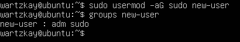
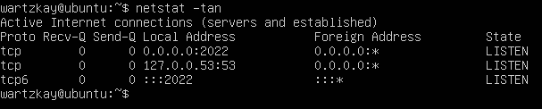
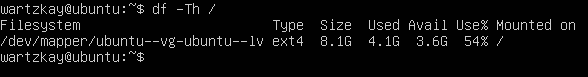
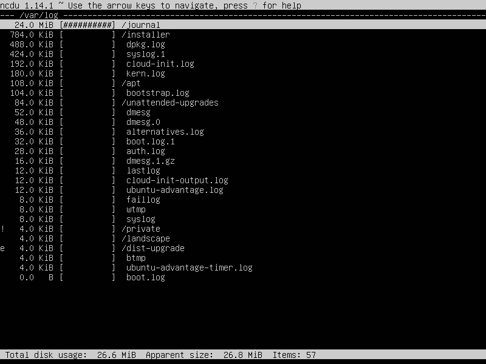

## Part 1. Установка ОС

- Смотрим версию Ubuntu после установки \

## Part 2. Создание пользователя

- Создаем пользователя и добавляем его в группу adm \

- Вывод команды ``cat /etc/passwd`` \

## Part 3. Настройка сети ОС

- Задаем новое название машины вида user-1 \

- Устанавливаем временную зону \

- Выводим названия сетевых интерфейсов \
 \
**lo (loopback device)** – *виртуальный интерфейс, присутствующий по умолчанию в любом Linux. С этим интерфейсом всегда связан адрес 127.0.0.1. У него есть dns-имя – localhost*

- Получение ip адреса данного устройства от DHCP сервера \
 \
**Протокол DHCP** *(Dynamic Host Configuration Protocol - протокол динамической настройки узла)*

- Выводим внешний IP-адрес \

- Выводим внутренний IP-адрес шлюза \

- Задаём статичные настройки ip, gw, dns в файле ``/etc/netplan/00-installer-config.yaml`` \

- потвержаем изменения и перезагружаем виртуальную машину \

- Проверяем изменения \

- Пропингуем удаленные хосты 1.1.1.1 и ya.ru \

## Part 4. Обновление ОС

- Обновляем OS \

## Part 5. Использование команды sudo

- Разрешаем пользователю, созданному в Part 2, выполнять команду sudo \
 \
**sudo** - *позволяет временно поднимать привилегии и выполнять задачи администрирования системы с максимальными правами*

- Меняем hostname \

## Part 6. Установка и настройка службы времени

- Вывод команды с корректным временем \

## Part 7. Установка и использование текстовых редакторов 

- Создание файла, выход с сохранением 

**vim** (ESC -> :wq filename) \
 \

**nano** (^o -> filename -> ^x) \
 \

**joe** (^kx -> filename) \

- Внесение изменений в файл, выход без сохранения 

**vim** (ESC -> :q!)
 \

**nano** (^x -> n) \
 \

**joe** (^c -> y) \

- Поиск, замена

**vim** (/что ищем, :s/что заменить/чем)
 \
 \

**nano** (^w -> что ищем, ^\ -> что заменить -> чем -> y)
 \
 \

**joe** (^k f -> что ищем -> i, ^k f -> что заменить -> r -> чем -> y)
 \
 

## Part 8. Установка и базовая настройка сервиса SSHD

- Устанавливаем службу SSHd ``sudo apt-install ssh``
- Добавляем автостарт службы при запуске системы ``sudo systemctl enable ssh``
- Перенастраиваем службу SSHd на порт 2022 \

- Отображаем наличие процесса \
 \
**ps** - *выводит сведения о процессах в статическом виде* \
**-e** - *позволяет выбрать все процессы* \
**| grep sshd** - *поиск по выводу через пайп* 

- Перезагружаем систему ``reboot``
- Вывод команды ``netstat -tan`` \
 \

**-tan:** \
  -a - *Показывает состояние всех сокетов* \
  -n - *Показывает ip адрес, а не сетевое имя* \
  -i - *Показывает состояние сетевых интерфейсов* \
  -r - *Показывает таблицы маршрутизации* \
  -s - *Показывает статистическую информацию по протоколам* \
  -l - *Показывает информацию о конкретном интерфейсе* \
  -p - *Отображает идентификатор/название процесса, создавшего сокет* \
  -f - *Ограничивает показ статистики или адресов управляющих блоков* \
  -o - *выводит активных подключений TCP и включение кода процесса (PID) для каждого подключения* \

**Proto** - *Содержит тип протокола* \
**Recv-Q** - *Счётчик байтов не скопированных программой пользователя из этого сокета* \
**Send-Q** - *Счётчик байтов, не подтверждённых удалённым узлом* \
**Local Address** - *Адрес и номер порта локального конца сокета* \
**Foreign Address** - *Адрес и номер порта удалённого конца сокета* \
**State** - *Состояние сокета* \
**0.0.0.0** - *немаршрутизируемый адрес IPv4 (по умолчанию)* 

## Part 9. Установка и использование утилит top, htop

- Uptime: 5 min
- 1 user
- Load average: 0.01, 0.06, 0.04
- Tasks: 94 total
- %Cpu(s): 1.7 us, 1.3 sy, 0.0 ni, 96.3 id, 0.3 wa, 0.0 hi, 0.0 si, 0.0 st
- MiB Mem: 1971.4 total, 1073.6 free, 159.1 used, 728.7 buff/cache
- PID 1077
- PID 1077

- htop сортировка по PID \
 

- htop сортировка по PERCENT_CPU \
 

- htop сортировка по PERCENT_MEM \
 

- htop сортировка по TIME \
 

- htop фильтр по процессу sshd \
 

- htop поиск процесса syslog \
 

- htop с добавленным выводом hostname, clock и uptime \
 

## Part 10. Использование утилиты fdisk

- Disk /dev/sda, size: 10 GiB, sectors: 20971520, swap: 1517564 \
 

## Part 11. Использование утилиты df

- ``df (KB)`` \
 \

- ``df -Th (ext4)`` \
 

## Part 12. Использование утилиты du

- Выводим размер папок /home, /var, /var/log (в байтах, в человекочитаемом виде) \
 

- Выводим размер всего содержимого в /var/log \
 

## Part 13. Установка и использование утилиты ncdu

- Выводим размер папок /home, /var, /var/log \
 \
 \
 \

## Part 14. Работа с системными журналами

- Время последней успешной авторизации, имя пользователя и метод входа в систему \
 

- Перезапуск службы SSHd \
 

## Part 15. Использование планировщика заданий CRON

- Используя планировщик заданий, запускаем команду uptime через каждые 2 минуты \ 
 

- Находим в syslog  uptime, выводим список текущих заданий для CRON, удаляем все задачи \
 

