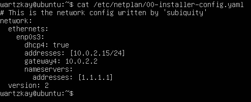

## Part 1. Установка ОС

- Смотрим версию Ubuntu после установки \

## Part 2. Создание пользователя

- Создаем пользователя и добавляем его в группу adm \

- Вывод команды ``cat /etc/passwd`` \

## Part 3. Настройка сети ОС

- Задаем новое название машины вида user-1 \

- Устанавливаем временную зону \

- Выводим названия сетевых интерфейсов \
 \
**lo (loopback device)** – *виртуальный интерфейс, присутствующий по умолчанию в любом Linux. С этим интерфейсом всегда связан адрес 127.0.0.1. У него есть dns-имя – localhost*

- Получение ip адреса данного устройства от DHCP сервера \
 \
**Протокол DHCP** *(Dynamic Host Configuration Protocol - протокол динамической настройки узла)*

- Выводим внешний IP-адрес \

- Выводим внутренний IP-адрес шлюза \

- Задаём статичные настройки ip, gw, dns в файле ``/etc/netplan/00-installer-config.yaml`` \

- потвержаем изменения и перезагружаем виртуальную машину \

- Проверяем изменения \

- Пропингуем удаленные хосты 1.1.1.1 и ya.ru \

## Part 4. Обновление ОС

- Обновляем OS \

## Part 5. Использование команды sudo

- Разрешаем пользователю, созданному в Part 2, выполнять команду sudo \
 \
**sudo** - *позволяет временно поднимать привилегии и выполнять задачи администрирования системы с максимальными правами*

- Меняем hostname \

## Part 6. Установка и настройка службы времени

- Вывод команды с корректным временем \

## Part 7. Установка и использование текстовых редакторов 

- Создание файла, выход с сохранением 

**vim** (ESC -> :wq filename) \
 \

**nano** (^o -> filename -> ^x) \
 \

**joe** (^kx -> filename) \

- Внесение изменений в файл, выход без сохранения 

**vim** (ESC -> :q!)
 \

**nano** (^x -> n) \
 \

**joe** (^c -> y)

- Поиск, замена

**vim** (/что ищем, :s/что заменить/чем)
 \
 \

**nano** (^w -> что ищем, ^\ -> что заменить -> чем -> y)
 \
 \

**joe** (^k f -> что ищем -> i, ^k f -> что заменить -> r -> чем -> y)
 \
 